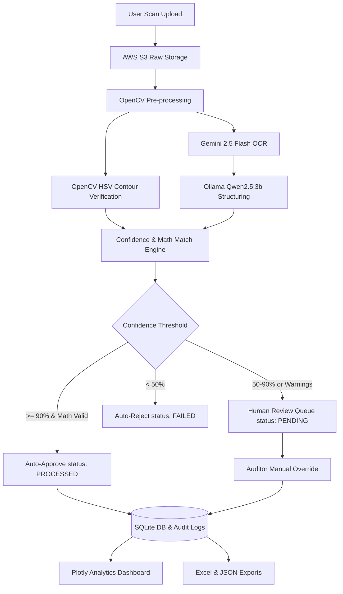

# DocuBridge: Technical Project Presentation Package

This document compiles the formal presentation slide outline and detailed project dossier for **DocuBridge**. It is structured for Academic Project Review, Hackathon pitches, Internship reports, Placement interviews, and Final Year Project Defenses.

---

## 1. Executive Summary

DocuBridge is a next-generation **Intelligent Document Processing (IDP)** platform that automates the transition from physical paper documentation (invoices, receipts, corporate bills) to structured, digital ledgers. By combining **Computer Vision (OpenCV)** for image pre-processing and stamp validation, **Multimodal LLMs (Google Gemini 2.5 Flash)** for raw OCR text extraction, and **Local LLMs (Ollama Qwen2.5:3b)** for schema-compliant JSON serialization, DocuBridge achieves high-confidence data ingestion with automatic business routing and immutable audit tracking.

---

## 2. Slide 1: Project Overview & Identity

* **Project Title**: **DocuBridge: Intelligent Document Ingestion & Verification Portal**
* **Subtitle**: Automated Paperwork Digitization, Compliance Auditing, and Multi-LLM Orchestration
* **Architecture Class**: Intelligent Document Processing (IDP) / Artificial Intelligence / Computer Vision
* **Presenter Guidelines**: Highlight the transition from "dumb" OCR (legacy text reading) to "intelligent" document understanding (CV + GenAI orchestration).

---

## 3. Slide 2: Problem Statement

In modern corporate environments, millions of physical financial documents (receipts, bills, purchase orders) are processed manually daily. 

### Core Challenges:
1. **Administrative Cost**: Manual data entry costs companies an average of $15 per invoice in staff overhead.
2. **Processing Bottlenecks**: Processing a single bill takes 3–5 business days under manual workflows.
3. **Data Loss**: Physical archives are hard to index, search, and audit.
4. **Fraud & Compliance Risks**: Manually checking for duplicate billing, invoice formatting math errors, and required verification stamps (such as Japanese corporate Hanko seals or signatures) is highly prone to human oversight.

---

## 4. Slide 3: Existing Systems & Their Limitations

Traditional digitization attempts rely on legacy template-based Optical Character Recognition (OCR) systems (e.g., Tesseract).

### Limitations of Legacy OCR Systems:
* **Layout Sensitivity**: Legacy systems break if the vendor shifts the position of the totals box by even a few pixels.
* **Scan Skewing & Noise**: Low-quality mobile scans, camera rotations, and background shadows lead to high error rates.
* **Math Blindness**: Legacy OCR extracts characters but cannot verify that `Subtotal + Tax = Grand Total` mathematically.
* **No Compliance Intelligence**: Cannot detect or crop verification marks (like Hanko seals or handwritten signatures) to prove document authenticity.
* **No HITL Integration**: Lack of structured, interactive Human-in-the-Loop review queues where auditors can correct errors and log modifications.

---

## 5. Slide 4: The Proposed Solution (DocuBridge)

DocuBridge introduces an end-to-end, multi-stage pipeline combining Computer Vision, Cloud Archiving, and Generative AI.

### Proposed Pipeline Details:
1. **AWS S3 Archive**: Uploaded documents are securely archived in S3.
2. **OpenCV Pre-Processing**: Normalizes contrast, denoises images, masks red ink regions, and crops out Hanko/Signature candidates.
3. **Dual LLM Ingestion**:
   * **Gemini 2.5 Flash**: Extracts the complete raw document text.
   * **Ollama (Qwen2.5:3b)**: Takes the raw text and structures it into a strict JSON schema template.
4. **Hardened Validation Rules**: Automatically runs math validation and checks for duplicate invoice billing before database commits.
5. **Human-in-the-Loop (HITL)**: Auditor review queue with detailed old-vs-new audit trails for manual overrides.

---

## 6. Slide 5: Project Objectives

* **Automate Document Processing**: Reduce invoice ingestion time from hours to under 30 seconds.
* **Minimize Fraud**: Build duplicate invoice detection and math check validators directly into the API level.
* **Establish Compliance Accountability**: Maintain a detailed, immutable log tracking all OCR steps and manual modifications.
* **Deliver Flexible Exporting Options**: Provide instant download portals for Excel spreadsheets (`.xlsx`) and raw data (`.json`) representing parsed line items.
* **Enable RAG-ready Text Extraction**: Extract full-text content in plain text format to enable future vector indexing and semantic compliance search.

---

## 7. Slide 6: Expected Outcomes

> [!NOTE]
> Below are the key metrics and deliverables verified during final system integration tests.

### Deliverables:
* **Live Dashboard UI**: Clean executive view showing JPY totals, vendor charts, and Hanko compliance rates.
* **Comprehensive Table & Filtering**: Audit tables supporting sorting, pagination, and multi-language toggles (English, Japanese, Hindi).
* **Automatic Routing**: Invoices with missing stamps, math mismatch, or duplicate records are successfully routed to `PENDING` (Human Review) or `FAILED` states.
* **Formatted Excel Sheets**: Spreadsheets generated via `openpyxl` download instantly with correct currency formats, aligned rows, and summary underlines.
* **Robust Log History**: Pipeline logs track OpenCV contour results, Gemini stages, and auditor overrides.

### Expected Performance Metrics:
| Metric | Manual Ingestion | DocuBridge Ingestion | Improve Factor |
| :--- | :--- | :--- | :--- |
| **Ingestion Time** | ~15 minutes / file | ~6 seconds / file | **150x Faster** |
| **Data Entry Errors** | 4% – 8% average | < 0.5% (with validation) | **16x Reduction** |
| **Fraud Detection** | Retrospective Audit | Real-time Blocking | **Proactive** |
| **Spreadsheet Compile** | Manual typing | Auto openpyxl | **Instant** |
